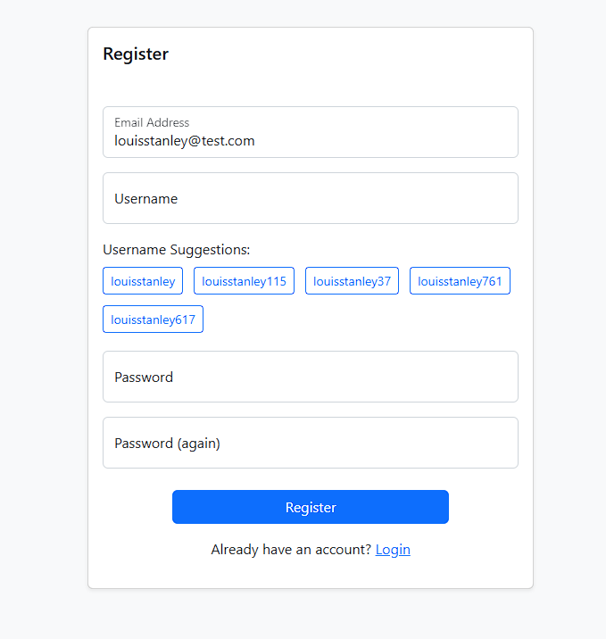

# CI4 Username Generator

A CodeIgniter 4 extension that adds username suggestions to Shield's registration process.

## Requirements

* CodeIgniter 4.3+
* CodeIgniter Shield
* PHP 7.4+

## Installation

```sh
composer require louisstanley/ci4-shield-username-suggest
```

## Quick Setup

1. **Copy the Register View**
   Copy the provided `register.php` view from the package into your CodeIgniter 4 app's views directory. For example:

   ```
   cp vendor/louisstanley/ci4-shield-username-suggest/src/Views/register.php app/Views/auth/register.php
   ```

2. **Set the View in Shield Config**
   In your `app/Config/Auth.php`, set the custom register view path:

   ```php
   public $views = [
       'register' => 'auth/register',
   ];
   ```

This ensures that Shield uses the modified view with username suggestions during registration.

## Features

* Generates usernames based on email addresses
* Shows available username options to users
* Allows one-click selection of suggested usernames



